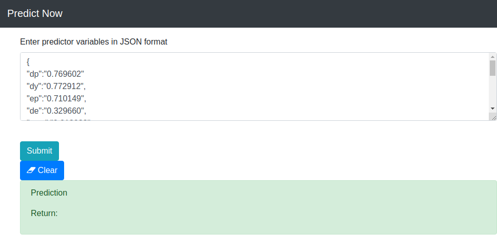

# Predict_Now

## Purpose
The purpose of this project is to build a machine learning model pipeline and 
expose it as an API

## Dataset
The dataset for this project was supplied in the form of a Microsoft&reg; Excel 
spreadsheet. It consists of 899 rows, each row being composed of the following 
14 columns: `dp`, `dy`, `ep`, `de`, `svar`, `bm`, `ntis`, `tbl`, `lty`, `ltr`, 
`tms`, `dfy`, `dfr`, and `infl`

## Data Ingestion and Model Training

### Preprocessing

The data is read from the excel file using the **pylightxl** library and then
loaded into a Pandas DataFrame. It is checked for null values and rows containing
nulls are dropped.

The data is split into the features dataframe, X, and the target list, y, and 
then into training and test subsets.

For use with the Naive Bayes classifier, the data is transformed using the 
MinMaxScaler.

### Processing

In order to obtain the best results possible, the data is used to train the
following models:

* `Logistic Regression`
* `Random Forest`
* `Support Vector Machines - RBF`
* `Naive Bayes`
* `K Nearest Neighbour`
* `Decision Trees`
* `Bagging Classifier`
* `AdaBoost Classifier`
* `Neural Network (using TensorFlow)`

Each of the models is training on the training dataset and tested on the test
dataset. During the training, model that achieves the best test data accuracy 
is saved to a file so that it can be used by the prediction tool.

## Design

### Required libraries

From within the project folder, run the following commands:

* `conda create --name <env_name> --file requirements_con.txt`
* `conda activate <env_name>`
* `pip install -r requirements_pip.txt`

### Components

The API is composed of two components: 

* an offline component whose purpose is to 
process new datasets and create the model files, and 
* an online compoenent whose 
purpose is to process API calls from the user. The online compoenent uses the 
ML model that was created by the offline component to make predictions with
regard to customer requests.

### Usage

First, set the __project_path__ entry in the pn_config.py file to the location
of the project folder.

__Training__

To train the machine learning model, the following steps are required:

* upload an excel file to the server 
* set the __excel_file__ entry in the pn_config.py file to the location of the
excel file
* set the __sheet_name__ entry in the pn_config.py file to the name of the sheet
in the excel while which contains the new data
  
The python script that performs the training function `PN.py.` It can be 
triggered from the command line if the permissions are set correctly. However,
this manual process is not reliable and, thus, a better alternative is needed.

The second way to trigger the `PN.py` script is through a cron job. To configure 
a cron job, run the `crontab -e` command to edit the crontab file. Since new data
is generated every month, running the file on a monthly basis should suffice. As
such, place the following entry into the crontab file:

`* * 15 * * /home/sami/education/DataScience/Sharpest_Minds/Predict_Now/PN.sh`

The `PN.sh` file is a shell script that sets the environment before prompting 
the `PN.py` process to run.  

__UI__

The system component that acts as the API for customer requests is the 
`predict.py` script which acts as a backend to the Flask web server. The script
expects a rawtext string in JSON format, which contains the column name -  column 
value pairs representing one row of predictor values, such as the following:

`{
"dp":"0.769602",
"dy":"0.772912",
"ep":"0.710149",
"de":"0.329660",
"svar":"0.012032",
"bm":"0.566133",
"ntis":"0.681045",
"tbl":"0.022713",
"lty":"0.058378",
"ltr":"0.472611",
"tms":"0.691463",
"dfy":"0.147059",
"dfr":"0.539720",
"infl":"0.245624"
}`

The `predict.py` script parses the string, creates a dataframe with a single 
row, loads the ML model, `predict_now,` from disk, and then runs the predict 
function to obtain and return the `Returns` value in json format, such as the 
following:

`{"Returns":["1"]}`

If an error is encountered in the processing of the request, the following json
response is returned:

`{"Returns":["Illegal data submitted"]}`

## Deployment

The following steps are required to deploy the API:

From the project folder:

* run the command `export FLASK_APP="predict.py"`
* run the command `flask run`

## Images

NB: This JSON payload in the image is incorrect and was used to test the response to API response to invalid request payloads.

